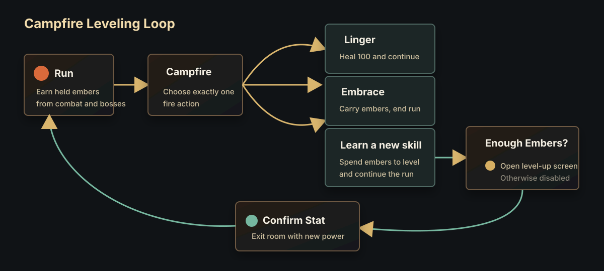
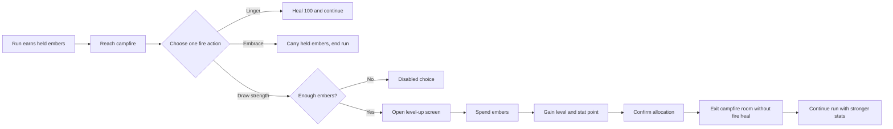
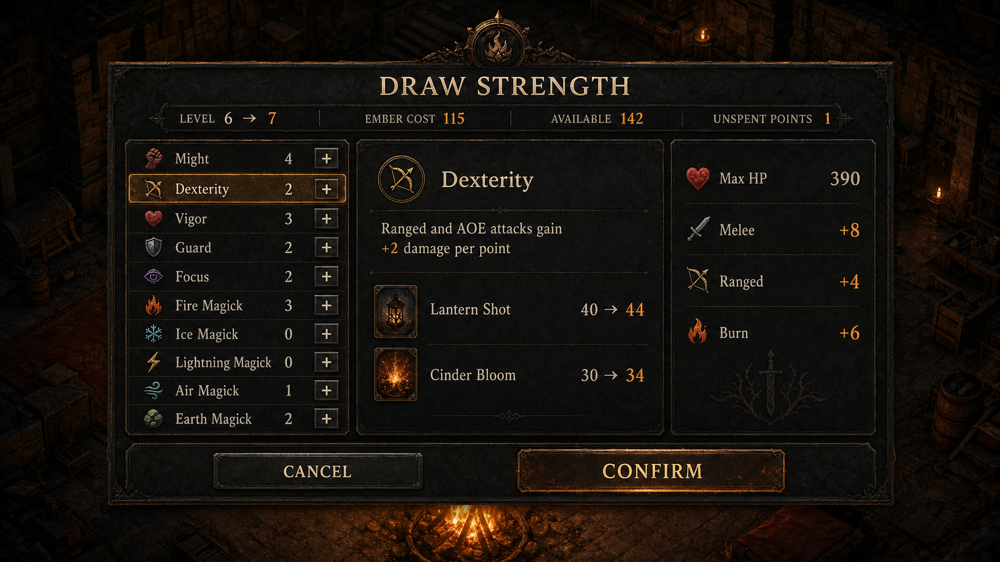
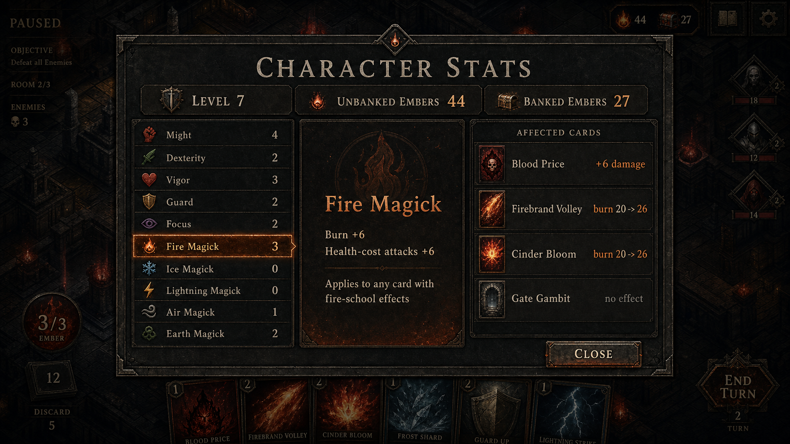
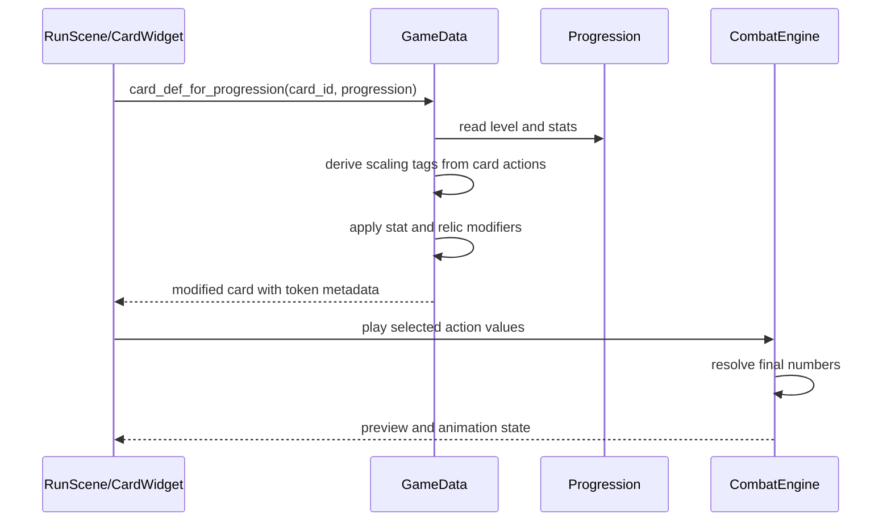

# Meta Leveling and Stat Scaling Spec

Status: proposal v0.2  
Owner: design iteration  
Primary goal: replace permanent per-card ember upgrades with campfire leveling,
character stats, and small fixed-point card-effect scaling.

## Design Intent

The new meta progression should make embers strengthen the character instead of
permanently mutating individual cards. Cards remain the tactical language of a
run; stats change how the hero expresses that language.

Current iteration principles:

- Embers buy character levels, not permanent card edits.
- Embers are a single held currency value. There is no separate banked versus
  unbanked ember pool.
- Leveling happens at campfires during a run.
- Each purchased level grants `2` stat points assigned to two different stats.
- Stats grant only per-point numeric bonuses in v0.2.
- Threshold bonuses, perk points, attunement, and run shaping are deliberately
  out of scope for now.
- Elemental investment is not a separate mastery system. Fire Magick, Ice
  Magick, Lightning Magick, Air Magick, and Earth Magick are normal stats in
  the same list as Might, Dexterity, Vigor, Guard, and Focus.
- Elemental stats scale their mechanical school wherever it appears, not only
  on matching-element cards.
- Gameplay rules remain in pure data/dictionary logic so headless tests can
  exercise progression, card resolution, and run generation.

## Visual Summary





## Fixed-Point Combat Scale

Use a `10x` fixed-point combat scale for granular numeric tuning. The player
sees whole numbers and the engine does not need fractional values.

Fields that scale by `10x`:

| Field family | Current example | New example |
| --- | ---: | ---: |
| Player/enemy HP | `36` max HP | `360` max HP |
| Attack damage | `9` damage | `90` damage |
| Block/stoneskin/heal | `8` block | `80` block |
| Health costs | `1` health | `10` health |
| Fatigue damage | `2` fatigue | `20` fatigue |
| Burn and poison damage | `burn 2` | `burn 20` |
| Potion and shield pickups | `4` heal/block | `40` heal/block |

Fields that do not scale:

- Embers and level costs.
- Draw amount.
- Card play amount.
- Movement, blink, attack range, push distance, pull distance.
- Freeze duration, shock duration, chain count, AOE tile patterns.
- Elemental intensity.

Burn should decay by `10` per enemy activation after the scale migration. This
preserves the old shape where `burn 2` deals `2`, then `1`, now represented as
`burn 20` dealing `20`, then `10`.

## Campfire Level-Up Flow



Campfires should offer three mutually exclusive choices:

| Choice | Description | Result |
| --- | --- | --- |
| Linger for a moment | Heal 100 and continue onward | Existing continue-run heal, scaled from current `10` HP heal. |
| Embrace the fire's warmth | Abandon your escape and carry your embers onward | Save currently held embers for the next run, clear saved run, return to menu. |
| Draw strength from the flame | Spend embers to become permanently stronger | Open level-up screen if enough embers are available. |

The third choice is disabled when the player cannot afford the next level.
Disabled presentation:

- Greyscale or dimmed icon.
- Muted title.
- Detail text: `Need {cost} embers`.
- No hover accent pulse.
- No click response except an optional short denied sound.

Level-up sequence:

1. The player enters a campfire room.
2. RunScene reads the current run's single `held_embers` value.
3. If `held_embers >= next_level_cost`, Draw Strength is enabled.
4. Choosing Draw Strength opens the level-up overlay in the campfire room.
5. The overlay previews the level cost, resulting level, and two new stat points.
6. Confirming level-up:
   - Spends the level cost directly from held embers.
   - Increments character level by `1`.
   - Grants `2` stat points assigned to two different stats.
   - Requires the point to be allocated before closing the overlay.
   - Saves progression and the current run.
   - Clears current room campfire mode and exits to normal room mode.
7. The player continues the same run with the new stat effects active.
8. The player does not receive the Linger heal.
9. The run is not abandoned and the saved-run slot is preserved.

The current room should be marked cleared after any of the three choices. Draw
Strength is therefore a real opportunity cost: permanent growth now, no fire
heal, no safe carry-forward escape.

Held ember lifecycle:

- Combat, boss rewards, pickups, and recovery markers add to `held_embers`.
- Linger keeps the same run going; held embers remain at risk.
- Draw Strength spends held embers and keeps the run going; unspent held embers
  remain at risk.
- Embrace ends the current run safely and carries held embers into the next run.
- Defeat clears held embers.
- Victory should be treated as safe extraction unless a later victory design
  says otherwise.
- The UI should say `Held Embers`, `Carried Embers`, or simply `Embers`, never
  `Banked Embers` or `Unbanked Embers`.

## Level Economy

Initial implementation:

- Start at character level `1`.
- Initial max level is `20`.
- Initial per-stat cap is `10`.
- Every level after level `1` grants `2` stat points.
- Stat points can be assigned immediately after leveling.
- There are no perk points in v0.2.
- Respec is free in debug/playtest builds; shipping cost remains undecided.

Suggested v1 ember cost table:

| New level | Ember cost | Total spent |
| ---: | ---: | ---: |
| 2 | 180 | 180 |
| 3 | 250 | 430 |
| 4 | 340 | 770 |
| 5 | 450 | 1220 |
| 6 | 580 | 1800 |
| 7 | 730 | 2530 |
| 8 | 900 | 3430 |
| 9 | 1090 | 4520 |
| 10 | 1300 | 5820 |
| 11 | 1530 | 7350 |
| 12 | 1780 | 9130 |
| 13 | 2050 | 11180 |
| 14 | 2340 | 13520 |
| 15 | 2650 | 16170 |
| 16 | 2980 | 19150 |
| 17 | 3330 | 22480 |
| 18 | 3700 | 26180 |
| 19 | 4090 | 30270 |
| 20 | 4500 | 34770 |

This table is intentionally hand-tuned for prototype iteration, but the first
level should already require a meaningful run. The target feel is that level
`2` requires either getting fairly deep into one run or safely carrying embers
out of several short campfire aborts.

## Stat List

All stats live in one upgrade list. There is no separate elemental mastery
interface in v0.2.

| Stat | Governs | Per point |
| --- | --- | --- |
| Might | Melee attack damage | `+2` melee damage |
| Dexterity | Ranged and AOE attack damage | `+2` ranged/AOE damage |
| Vigor | Max HP, healing, health costs | `+10` max HP, `+2` healing, `-1` health cost to a minimum of half printed cost |
| Guard | Block, stoneskin, illusion health | `+2` block, `+1` stoneskin, `+2` illusion health |
| Focus | Elemental intensity actions and intensity-gated numeric payoffs | `+1` intensity gain on `intensity` actions; `+2` scaled numeric fields inside `intensity_bonus` payloads |
| Fire Magick | Burn, health-cost attacks, burning-kill rewards | `+2` burn; `+2` attack damage on health-cost cards |
| Ice Magick | Freeze, frozen-target payoffs, defensive control | `+2` damage against frozen enemies; applying freeze grants `+2` block |
| Lightning Magick | Shock, chain, shock tempo | `+2` damage on attacks that shock or chain |
| Air Magick | Push, pull, move, blink, long movement | `+2` push/pull damage; blink cards grant `+2` block after blink |
| Earth Magick | Poison, stoneskin, illusions, sturdy melee | `+2` poison; `+1` stoneskin; `+2` illusion health |

Design notes:

- Might no longer boosts ranged or AOE attacks. This reduces the "obvious dump
  stat" problem created by all-damage scaling.
- Dexterity gives ranged/AOE builds their own damage stat.
- Focus is strengthened from the prior draft. It now improves intensity gain
  directly, which is more visible than only adding to conditional payoffs.
- Movement scaling no longer lives in a narrow Finesse stat. Air Magick owns
  movement-adjacent combat scaling for now because push, pull, blink, and long
  movement are already the Air mechanical identity.
- Threshold bonuses are intentionally removed. If a stat feels bad without a
  threshold bonus, fix its per-point identity first.

## Card Scaling Tags

Each action receives derived scaling tags before combat starts. Tags are based
on mechanics, not only card element.

| Action shape | Tags |
| --- | --- |
| `melee` with damage | `might` |
| `ranged` or `aoe` with damage | `dexterity` |
| `push` or `pull` with damage | `air_magick`; `might` only if implemented as adjacent physical force |
| Health-cost card with an attack | `fire_magick` |
| Action applies `burn` | `fire_magick` |
| Action applies `freeze` or attacks a frozen target | `ice_magick` |
| Action applies `shock` or has `chain` | `lightning_magick` |
| Action has `push`, `pull`, `move`, or `blink` | `air_magick` |
| Action applies `poison`, grants `stoneskin`, or creates `illusion` | `earth_magick` |
| Action has `type: "intensity"` or `intensity_bonus` | `focus`, plus the relevant elemental magick stat |

Example: `Blood Price` is a neutral card, but it has a health cost and a melee
attack. It scales with Might and Fire Magick even when the run has no Fire
cards.

Example: `Lantern Shot` scales with Dexterity because it is ranged. If a relic
or future modifier adds shock to it, Lightning Magick also applies.

Example: `Shadow Step` scales with Guard and Earth Magick through illusion
health, and with Air Magick through blink-side defensive scaling.

## Card UI

Card widgets should show final modified values as the primary numbers. Modifier
source detail belongs in token-level metadata:

- A modified value gets a small source badge.
- Physical stats use restrained metal/gold badges.
- Magick stats use the element color.
- Hovering or inspecting the token shows concise source math.
- Combat previews use the final value and do not require players to do math.

Example token tooltip text:

```text
164 damage
Base 150
+8 Might
+6 Fire Magick
```

Normal in-combat cards should not show long explanatory rules text. The card
detail view, level-up overlay, and character stats screen can show source
breakdowns.

## Example Card Outcomes

Assume:

- Might `4`
- Dexterity `2`
- Vigor `3`
- Guard `2`
- Focus `2`
- Fire Magick `3`
- Earth Magick `2`

Scaled examples:

| Card/action | Base | Modified | Why |
| --- | ---: | ---: | --- |
| Quick Stab damage | `90` | `98` | `+8` Might |
| Lantern Shot damage | `40` | `44` | `+4` Dexterity |
| Blood Price health cost | `30` | `27` | `-3` Vigor, capped at half printed cost |
| Blood Price damage | `150` | `164` | `+8` Might, `+6` Fire Magick because it is a health-cost attack |
| Patch Up heal | `30` | `36` | `+6` Vigor |
| Brace block | `80` | `84` | `+4` Guard |
| Shadow Step illusion health | `20` | `28` | `+4` Guard, `+4` Earth Magick |
| Firebrand Volley burn | `20` | `26` | `+6` Fire Magick |
| Stone Plate stoneskin | `40` | `44` | `+2` Guard, `+2` Earth Magick |
| Any `Fire 3+: +30 damage` bonus | `+30` | `+40` | `+4` Focus, `+6` Fire Magick if the bonus is Fire-school damage |

## Level-Up Screen UI

The level-up screen appears from the campfire Draw Strength choice.

Primary layout:

- Top bar: current level, next level cost, held embers, resulting level.
- Left column: stat list with plus/minus controls.
- Middle: selected stat detail and affected card examples.
- Right: character preview with derived max HP and a compact stat summary.
- Bottom: confirm and cancel.

Rules:

- Cancel returns to the campfire choices without spending embers.
- Confirm is disabled until all newly granted stat points are assigned.
- Confirm exits the campfire room after saving.
- The screen should be readable with a gamepad/keyboard focus path later.
- Copy should stay terse: `Might`, `+2 melee damage`, `Need {cost} embers`.

The level-up concept image is visual direction only. Its exact numeric cost
copy predates the larger cost table and should be replaced by live cost data.

## Character Stats Screen



The player can inspect character stats during a run without spending points.
This is a read-only panel reachable from the existing camp/menu surface.

Primary layout:

- Header: character level and held ember count.
- Left: full stat list and values.
- Middle: selected stat effects.
- Right: affected cards in current deck, sorted by strongest modification.
- Footer: close/back.

This screen should not explain basic combat rules. It should answer, "What did
my permanent stats do to this run?"

Useful read-only rows:

- `Might 4: +8 melee damage`
- `Dexterity 2: +4 ranged/AOE damage`
- `Fire Magick 3: +6 burn, +6 health-cost attack damage`
- `Affected cards: Blood Price, Firebrand Volley, Cinder Bloom`

The existing concept mockups are visual direction only. Their ember labels
should be updated during implementation to use the single-currency language
above, such as `Held Embers 71`.

## Data Model

Add progression fields:

```gdscript
{
    "embers": 0, # currently held/carried embers, not a permanent bank
    "level": 1,
    "unspent_stat_points": 0,
    "stats": {
        "might": 0,
        "dexterity": 0,
        "vigor": 0,
        "guard": 0,
        "focus": 0,
        "fire_magick": 0,
        "ice_magick": 0,
        "lightning_magick": 0,
        "air_magick": 0,
        "earth_magick": 0
    },
    "progression_schema": 2
}
```

Run snapshots should copy:

- `level`
- `stats`
- `held_embers`

Implementation storage rules:

- When no run is active, `progression.embers` stores the held ember amount that
  was safely carried out of the prior run.
- Starting a run copies `progression.embers` into `run_state.held_embers`.
- The run owns ember changes while active.
- Embrace and victory copy `run_state.held_embers` back to
  `progression.embers`.
- Draw Strength spends from `run_state.held_embers`, then syncs the saved
  progression and current run.
- Defeat sets both `run_state.held_embers` and `progression.embers` to `0`.
- Do not keep both `progression.embers` and `run_state.unbanked_embers` visible
  as separate player-facing totals.

Recommended new data files:

- `data/progression_levels.json`: level cost table and max level.
- `data/stats.json`: display data, caps, per-point rules, and scaling tags.

No `data/perks.json` is needed for v0.2.

Card scaling should be applied through `GameData.card_def_for_progression` or a
nearby helper so the same card definition powers UI previews, combat resolution,
and analytics. Store modifier sources under action token metadata, following
the current `_modifiers` pattern used by relic card-action changes.

## Card Resolution Pipeline



Implementation rule: presentation may display modifier sources, but combat
state owns final gameplay values.

## Analytics

When implemented, update `spec/analytics.md` and append fields to existing
events:

- `progression_level`
- `progression_stats`
- `card_scaling_sources` on `card_played.payload`
- `printed_value` and `modified_value` for changed action tokens

Add a new event if useful:

- `level_up`: records previous level, new level, ember cost, stat assignment,
  current room coord, and whether the level-up happened at a campfire.

Keep the event contract additive.

## Balance Guardrails

- At level `20`, a focused damage stat should increase its primary attack
  family by roughly `20-35%`, not double it.
- No single stat should touch most cards in the pool.
- Might should improve melee only.
- Dexterity should improve ranged and AOE only.
- Elemental magick stats should be useful when the school mechanic appears,
  premium when the matching card element appears, and never required for base
  card function.
- Draw, card play, movement range, blink range, freeze duration, shock duration,
  chain, and AOE shape should not receive per-point stat scaling in v0.2.
- If `cards_per_turn` or `draw_per_turn` changes permanently in a later pass,
  update `spec/card_balance_heuristic.md` and `tools/card_heuristic.py` in the
  same implementation change.
- If the `10x` scale changes card values, update the heuristic to either work
  in scaled values or normalize back to old health-saved equivalents.

## Migration From Card Upgrades

Recommended migration for existing progression data:

1. Read legacy `card_mods`, `card_upgrades`, and `purchased_upgrades`.
2. Sum known `cost_paid` values from generated card mods.
3. For legacy upgrades without stored cost, refund `GameData.upgrade_cost`.
4. Add the refund to the single held `embers` value.
5. Clear `card_mods`, `card_upgrades`, and card-specific purchased upgrades.
6. Preserve `run_counter`, fire-rest dialogue flags, and recovery marker.
7. Set `level` to `1`, stats to zero, and unspent points to zero.

If we want playtesters to keep approximate power, run a one-time conversion
that grants levels from refunded ember totals instead of only refunding held
embers.
The simpler v1 path is refund-only.

## Implementation Milestones

1. Add data model and save migration.
2. Add fixed-point combat scale migration for cards, enemies, loot, fatigue,
   and UI labels.
3. Add stat data and pure helper functions.
4. Add Draw Strength as a third campfire choice with disabled state.
5. Replace card upgrade overlay with the campfire level-up UI.
6. Add read-only character stats screen.
7. Apply stat scaling in card definitions and combat previews.
8. Update analytics, card heuristic, and headless tests.
9. Run balance playtests against level `1`, `5`, `10`, and `20` fixtures.

## Open Questions

- Should the player see large fixed-point values directly, or should UI display
  compact old-scale values while combat stores scaled values?
- Should respec be free forever, ember-priced, or campfire-limited?
- Should Draw Strength allow multiple level purchases at one campfire if the
  player has enough embers, or exactly one level per campfire?
- Should neutral card infusion be a later feature that lets a run temporarily
  attach an elemental magick school to one starter card?
