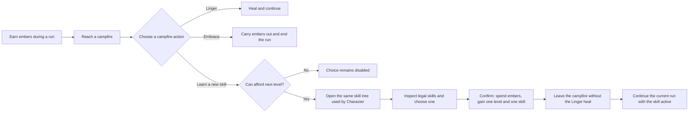
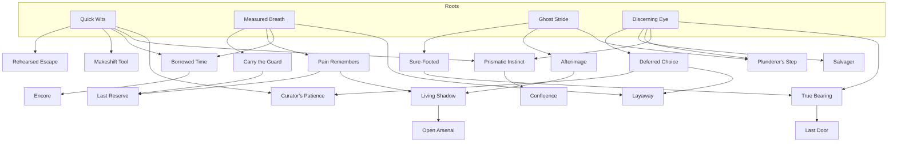

# Qualitative Skill-Tree Meta Progression

Status: implemented

Owner: progression and combat design

Primary data: `data/skills.json`

Primary rules: `scripts/skill_tree_library.gd`, `scripts/progression_store.gd`,
`scripts/run_engine.gd`, and `scripts/combat_engine.gd`

## Design Contract

Embers buy character levels at campfires. Every purchased level teaches exactly
one permanent skill. Skills expand the player's options, recovery lines, and
ways to combine existing systems without adding permanent damage, health,
initiative, draw, or other raw stat growth.

The system follows these rules:

- The existing campfire choices and their opportunity costs stay intact.
- Level `1` starts with no learned skills. Level `N` owns exactly `N - 1`
  skills, up to `19` learned skills at level `20`.
- A level purchase, ember payment, and skill choice are one atomic action.
- Learned skills are cumulative and remain active in current and future runs.
- The tree contains `24` skills arranged in four interconnected branches.
- A profile may learn at most one of the four keystones, and every complete
  level-`20` build contains exactly one.
- Respec requires one Moltshard and replaces the entire learned selection in a
  single confirmed transaction.
- Moltshards are progression currency. They never enter the in-run item deck,
  item inventory, equipment inventory, or reward inventory.
- Retired permanent card edits and numeric character allocations have no live
  effect. Existing saves are migrated and their retired card spending is
  refunded as embers.
- The combat-number display scale is independent of this system. Changing that
  scale must not change skill unlocks or add numeric meta growth.

## Player Flow



Learning a new skill grants one level per campfire visit. Canceling the tree returns
to the campfire choices without spending embers or changing the profile.

The ember costs remain data-driven in `data/progression_levels.json`. The
current curve starts at `180` embers for level `2`, reaches `1,300` for level
`10`, and ends at `4,500` for level `20`.

## Tree Shape

The four root branches are Tactics, Resolve, Traverse, and Foresight. Later
nodes cross branch boundaries so a build becomes a web rather than four linear
tracks.



Keystones require at least eight already learned skills. All keystones share
one exclusivity group, so choosing one permanently closes the other three until
a respec. If the player reaches their nineteenth and final skill point without
a keystone, only eligible keystones can spend that point; the tree states this
requirement explicitly instead of allowing a capped build that needs a respec
to reach its capstone.

The authored `position` field preserves deterministic progression ordering.
The separate `layout_position` field arranges the visible graph by dependency
depth: Measured Breath, Quick Wits, Discerning Eye, and Ghost Stride are ordered
to shorten their shared junctions; root-only junctions share the first child
rank; deeper junctions are staggered; and every keystone occupies the final
rank. Visual layout changes must not silently change migration, default-focus,
or build-repair order.

`SkillTreeLibrary` validates that the graph is acyclic, every prerequisite is
known, every node is reachable, exclusivity is respected, and a requested
selection has the exact number of skills required by the profile's level.

## Skill Roster

### Roots

| Skill | Activation | Effect |
| --- | --- | --- |
| Quick Wits | Manual, once per combat | Discard a card to draw a card without spending a play or Time. |
| Measured Breath | Automatic | End an activation with an unused play to bank one play for the next activation. |
| Ghost Stride | Contextual, once per combat | You may use a card's basic Move as Blink `2`. |
| Discerning Eye | Contextual, once between bosses | Replace every card in a combat reward. |

### Branch skills

| Skill | Requires | Effect |
| --- | --- | --- |
| Rehearsed Escape | Quick Wits | Once per combat, arm to discard the next non-item Burn card instead of burning it. It is offered only while a qualifying card is in hand and spends its charge when preservation resolves. |
| Makeshift Tool | Quick Wits | Once per combat, arm to discard the next item used as a basic Attack or Move instead of consuming it. It is offered only while an item is in hand and spends its charge when preservation resolves. |
| Carry the Guard | Measured Breath | Once per combat, after gaining block, arm during an activation to convert all block remaining at its end into stoneskin. |
| Pain Remembers | Measured Breath | After the first health loss each combat, when the hand has room, return the next non-item discard to it. |
| Sure-Footed | Ghost Stride | Once per combat, the first trap blast that would affect the player leaves them untouched and resolves normally against everything else. |
| Afterimage | Ghost Stride | The first Blink each combat leaves a `20`-health illusion behind. The player may move through friendly illusions; ending on one dispels it. |
| Deferred Choice | Discerning Eye | Skip a card reward to save one offered card; it replaces a card in the next reward. |
| Salvager | Discerning Eye | Once between bosses, recover the first equipment drop left uncollected after victory. |

### Junction skills

| Skill | Requires | Effect |
| --- | --- | --- |
| Borrowed Time | Quick Wits + Measured Breath | The first card paid for with a banked play each combat adds no Time. |
| Last Reserve | Carry the Guard + Pain Remembers | Once per combat, lethal Fatigue leaves the player at `10` health. |
| Plunderer's Step | Ghost Stride + Discerning Eye | The first Move or Blink to collect loot each combat refunds its play. |
| Prismatic Instinct | Quick Wits + Discerning Eye | Once per combat, name a card with an intensity condition in hand. The next printed play of any copy satisfies all its intensity conditions; basic uses do not consume it. Duplicate names appear as one choice. |
| Curator's Patience | Quick Wits + Deferred Choice | After choosing a relic, save one unchosen relic for the next relic offer. |
| Living Shadow | Pain Remembers + Afterimage | Once between the player's activations, a destroyed or dispelled illusion returns the latest non-item discard to hand, or atop the draw pile if the hand is full. |
| True Bearing | Sure-Footed + Discerning Eye | Before combat, choose an open starting tile within `2` tiles of the entrance. |
| Layaway | Measured Breath + Deferred Choice | Once between bosses, hold one offer for the next merchant of that type. A pending hold blocks future uses until it returns. |

### Keystones

| Skill | Requires | Effect |
| --- | --- | --- |
| Encore | Borrowed Time | Once per combat, manually return a non-item discard to hand without spending a play or Time. |
| Open Arsenal | Living Shadow | Passively equip any equipment in the trinket slot, ignoring its normal slot. |
| Confluence | Prismatic Instinct | Passively let intensity conditions use the player's highest intensity, regardless of element. A draw enabled solely by Confluence stops before it would trigger Fatigue. |
| Last Door | True Bearing | Once between bosses, a non-boss defeat returns the player to the previous room at `10` health; spent items remain spent. |

The small numbers inside a few effects define new objects, distances, or
survival states. They are not scalable permanent bonuses and cannot be ranked
up.

## Respec and Moltshards

The first boss victory of a run awards one Moltshard. Award resolution is
idempotent: replaying or resuming the same boss outcome cannot duplicate it.
The combat result tells the player that the resource was acquired, while the
resource total appears only in the Skills menu and its respec draft.

Respec behavior:

1. Open Character and choose the Skills tab.
2. `Begin Respec` is enabled only when at least one skill and one Moltshard are
   available, the run is outside combat, and no uninterruptible presentation is
   active. The tree remains available read-only during combat.
3. The replacement draft begins empty. All `level - 1` earned skill points are
   immediately available in the menu, while the committed build remains active
   in the profile and current run.
4. Skills are rebuilt from the roots. Adding a legal node spends one draft
   point, removing a leaf refunds one, prerequisites must be allocated first,
   and the UI prevents spending beyond the earned point total.
5. The draft must spend every refunded point and pass the complete graph
   validator. Rebuilding the exact committed set remains non-confirmable so a
   Moltshard cannot be wasted without changing the build.
6. Cancel, Escape, or closing the menu discards the draft for free and leaves
   the active build untouched.
7. Confirming a changed legal draft consumes exactly one Moltshard, increments
   the progression revision, saves the profile, and updates the active run.
8. The confirm path compares the draft's starting revision, level, skill set,
   and Moltshard count against the latest persisted profile. A stale draft can
   never overwrite newer progression.

Already-earned run choices survive a respec: a card saved by Deferred Choice,
a relic saved by Curator's Patience, or stock held through Layaway still enters
its next matching offer exactly once. Removing the source node prevents earning
another pending benefit; it does not confiscate one the player already earned.

Combat-limited abilities cannot be refreshed through respec because build
changes are unavailable during active combat. Defensive revision reconciliation
still preserves use flags if a newer profile reaches a saved combat snapshot,
and clears invalid pending state such as a removed Prismatic arm, Rehearsed
Escape, Makeshift Tool, or Carry the Guard arm, Pain Remembers prime, or
Measured Breath bank.

## Character and Combat UI

The Character menu has three tabs:

- Gear
- Magic
- Skills

Skills fully replaces the retired numeric allocation tab. The same tree view is
used for read-only inspection, campfire level-up, and transactional respec.
The graph uses compact semantic-icon medallions rather than persistent name
cards. Root, branch, junction, and keystone roles have distinct shapes and
scales. Learned, available, locked, chosen or drafted, and exclusive states use
independent fills, borders, state glyphs, and a persistent legend; branch color
is only a small secondary accent.

Names and rules text live in the persistent detail pane and tooltips, so no
label can cover a dependency. Every connection runs between an explicit output
and input port, uses an opaque core at least `3` pixels wide over a dark
under-stroke, avoids every unrelated node, and terminates in a target arrowhead
drawn above node shadows. Direction is communicated redundantly by the
top-to-bottom dependency ranks and those exposed arrowheads. Ordinary routing
bends have no dots; dots are reserved for future authored semantic junctions.
When two non-incident routes must cross, their draw priority is deterministic
and the lower route has an explicit `20`-pixel break beneath the continuous
upper route. Unrelated routes may never share a collinear rail, so a crossover
cannot be mistaken for a prerequisite merge.
Focusing a skill strengthens its complete ancestor path and direct unlocks
without hiding the rest of the graph. The skill-tree modal expands at larger
viewports; at compact viewports, automatic horizontal and vertical scrolling
preserves the same readable node spacing instead of compressing the topology.
Focus automatically scrolls its medallion into view. Every node requires an
explicit bounded layout coordinate. Opening
the tree transfers GUI focus to its focused node; horizontal navigation stays
within the visible rank, vertical navigation follows dependency links, and a
rank edge exits to the visible action, footer, Begin Respec command, or active
Character tab instead of falling through to an unrelated node. The active tab
returns to the remembered tree node, and Begin Respec links back to the tabs.
Mouse hover also takes real GUI focus, so subsequent controller or keyboard
Accept can never activate a stale node. Controller Accept performs the focused
medallion's enabled action, and completing a build transfers focus to Confirm.
The detail pane shows the full effect, activation kind, individually satisfied
or missing prerequisites, direct unlocks, minimum learned count, and lock
reason. Variable-length rules copy scrolls inside that fixed pane while the
current action and Cancel/Confirm footer stay pinned, so requirements cannot
increase the Character modal's height or hide its chrome at `1280x720`.

During combat, learned skills appear through a violet SkillSigil beside—but
visually distinct from—the relic row. Its popover lists every learned skill as:

- `READY` when a manual or contextual use is currently available.
- `SPENT` when its combat or sequence use has been consumed.
- `WAITING` when its trigger has not yet occurred.
- `ARMED` or `PRIMED` while a selected future effect is pending.
- `BANKED` while Measured Breath has stored a play.
- `AUTOMATIC` for recurring rules that need no player input.
- `PASSIVE` for always-on rules.

The popover grows with the available viewport up to a bounded maximum. Its
informational rows receive explicit controller focus, follow focus while
scrolling, and preserve the focused skill and scroll position across HUD
refreshes.

Manual abilities expose actions only when they can legally resolve. One or two
ready abilities use direct buttons; three or more collapse into a single
`Ready Skills (N)` command whose dialog lists every ready ability and its full
description. This keeps the worst-case action strip clear of the card hand.
Trigger events pulse the SkillSigil and feed bounded,
revisioned analytics events so redraws and save/resume cannot duplicate them.

## Persistence and Migration

Progression schema `4` stores:

```gdscript
{
    "embers": 0,
    "level": 1,
    "skill_ids": [],
    "moltshards": 0,
    "moltshard_award_ids": [],
    "progression_analytics_outbox": [],
    "progression_revision": 0,
    "progression_schema": 4
}
```

The normal profile also retains unrelated run-history, grimoire, recovery, and
onboarding fields.

Normalization always repairs `skill_ids` to exactly `level - 1` legal skills.
Schema-`3` level-`20` profiles without a keystone migrate to one complete legal
build with exactly one eligible keystone and advance their progression revision.
Legacy numeric allocations are converted deterministically, using their former
distribution only to choose a reasonable branch preference. Retired permanent
card upgrades are erased and known spending is refunded to embers. Forged
retired fields are stripped from profiles, new runs, resumed runs, and active
combat snapshots.

An active run embeds a normalized progression snapshot and its revision. When a
newer profile is loaded, `RunEngine.reconcile_progression_revision` applies the
new tree. A same-level respec preserves the run's unbanked ember total. A newer
level adopts the profile's post-purchase ember total so a profile-first torn
save cannot restore already-spent embers. If that stale snapshot still shows
the campfire, reconciliation consumes the already-used campfire choice without
granting its heal. This keeps both transactions durable when the profile and
run snapshot are saved on different frames.

The inverse torn-write case is repaired as well. If a resumed run contains a
newer progression revision than the standalone profile (for example, a boss
award whose first profile write failed), resume backfills that revision before
respec. The repair preserves the standalone ember total so held run embers are
never banked accidentally; a respec transaction can also use the newer active
revision as its recovery authority while still rejecting a genuinely newer
external profile.

## Analytics and Balance

`spec/analytics.md` defines the additive events and context:

- `progression_level_up`
- `progression_respec`
- `progression_moltshard_gained`
- `skill_triggered`
- `progression_skills` and `moltshards` on relevant events

Card scoring stays anchored to printed cards and a fixed-initiative, no-skill
reference profile. Qualitative skills are analyzed as cohort and interaction
effects rather than being folded into intrinsic card coefficients. See
`spec/card_balance_heuristic.md`.

Balance review should watch for:

- Skills that are technically qualitative but behave like mandatory draw,
  play, or damage multipliers in most encounters.
- Trigger conditions so narrow that a learned node is routinely invisible.
- Reward deferral loops that preserve more than one pending card, relic, or
  merchant offer.
- Save/resume or respec paths that reset once-per-combat or once-per-sequence
  limits.
- Combinations that bypass item consumption, defeat, or Time more often than
  their explicit use limits allow.

## Verification

The implementation is covered by focused suites for:

- Graph validity, reachability, exclusivity, and repair.
- One-skill-per-level purchases and exact maximum-level counts.
- Legacy save migration and removal of retired growth fields.
- Moltshard acquisition, idempotence, transaction cost, cancel behavior, and
  anti-refresh semantics, including empty replacement drafts, refunded point
  accounting, hard allocation caps, and stale-revision rejection.
- Profile-first torn saves for both boss awards and level-up ember spending.
- Every combat and run-level skill effect.
- Skills tab replacement and absence of numeric allocation controls.
- SkillSigil status, manual ability dialogs, reward rerolls, and respec resource
  isolation.
- Analytics schema, combat/run trigger crash recovery, and card-heuristic
  progression context.
- 1280x720 and 1920x1080 visual probes for learned/available/locked trees,
  empty refunded respec drafts, complete replacement builds with focused
  cross-branch prerequisites, a complete long ancestor path, and combat states.
  Geometry tests additionally
  require distinct multi-parent ports, zero connector-node intersections,
  zero unrelated collinear overlaps, an explicit crossover bridge at every
  non-incident route intersection,
  opaque `3`-pixel minimum links with separating under-strokes, loaded semantic
  icons, one exposed target arrowhead per dependency, at least `10` pixels of
  visible incoming segment, semantic live controller focus neighbors, every
  medallion wholly inside its authored canvas, and automatic scrollbars whenever
  the compact host cannot show the authored graph at full size.

Any future skill must add or update its data definition, relevant engine hook,
HUD status semantics, analytics trigger, focused test, and this specification in
the same change.
